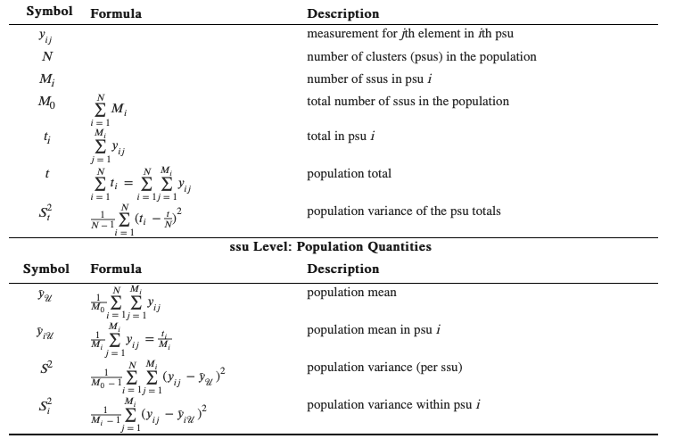
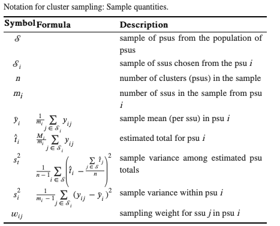

```{r setup, include=FALSE, warning = FALSE, messages = FALSE}
knitr::opts_chunk$set(echo = TRUE)
library(tidyverse)
library(sampling)
library(SDAResources)
```

## Introduction 

These are notes based on Sampling by *Sharon Lohr*. 

## Chapter 1 

### Vocabulary 

*Bias*: Systematic error in the sampling, measurement, or estimation procedure that results in a statistic being consistently different than the population characteristic $E[\hat{\tau}] \neq \tau$ even with infinite data. 

*Convenience sample*: A sample in which the primary consideration for sample selection is the ease with which units can be recruited. 

*Measurement error*: The difference between the response coded and the true value of the characteristic being studied for a respondent. 
*Nonsampling error*: An error for any source other than sampling error. For example, undercoverage, nonresponse, measurement error. 

*Observation unit*: An object on which a measurement is taken in the survey. 

*Representative sample*: A sample that can be used to estimate quantitites of interest in a population and provide measures of accuracy about the estimates. 

*Sampled population*: The collection of all possible observation units that might have been chosen using the sampling procedure. 

*Sampling error*: Error in estimation due to taking a sample instead of measuring every unit in the population. 

*Sampling frame*: A list, map, or other specification of units in the population from which a sample may be selected. Examples are list of college students, a map of a village, or a phonebook. 

*Sampling unit*: An object that can be sampled from the population. 

*Selection bias*: Bias that occurs because the actual probabilities with which units are sampled differ from the selection probabilities specified by the investigator. 

*Target population*: The set of units that the researcher wants to study. 

### Questionnaire Design 

1. Test questions before taking the survey. 
2. Keep questions simple and clear
3. Define the terms in the question to avoid confusion. 
4. Relate all question to the concept of interest. 
5. Decide whether to use open or closed questions. 
  - *open questions* allow respondents to form their own response categories. If using a closed-ended question always have an other category. 
6. Pay attention to response option scales. 
7. Avoid questions that prompt or motivate respondent to answer in a particular way. These are *loaded* questions. 
8. Consider social desirability of responses to questions and write questions and use modes that elicit accurate responses. 
9. Avoid double negatives in questions. 
10. Use forced choice rather than agree/disagree questions. 
11. Ask only one concept per question. Compound or *double-barreled* questions will lead to confusion by respondents. 
12. Pay attention to question order effects. If you ask more than one question on a topic, it is usually better to ask the general question first followed by specific questions. 

## Chapter 2: Simple Random Sampling

### Vocabulary 

*Simple Random Sample (SRS)*: A sample of size *n* is taken when every possible subset of *n* units in the population has the same chance of being in the sample. 
  - With replacement can be thought of as drawing n independent samples of size 1 from a population of N units. 
  - without replacement is when a sample of size n is selected that every possible subset of n distinct units in the population has the same probability of being selected as the sample. 
  
In a simple random sample without replacement, the probability that unit *i* of the population appears in the sample is $\pi_i = \frac{n}{N}$. The *sample weight* for each unit in the sample is $w_i = \frac{1}{\pi_i} = \frac{N}{n}$ because each unit in the sample can be thought of as representing $\frac{N}{n}$ units in the population.

*Stratified Random Sample*: Population is divided into subgroups (known as strata). A SRS is taken from each stratum independent of the other strata. 

*Cluster sample*: Observation units are aggregated into larger sampling units. SRS is taken at the aggregated level. If in an experimental context, all members of a cluster must receive the same treatment assignment. 

*Systematic sample*: A starting point is chosen from a list of population members using a random numbers. That unit and every $k^{th}$ unit thereafter is chosen to be in the sample. 

*Sampling distribution*: The distribution of different values of the statistic obtained by the process of taking all possible samples from the population. 

*Coefficient of variation (CV)*: The CV of a statistic $\theta$ where $E[\hat{\theta}] > 0$ is CV $\hat{\theta} = \sqrt{\frac{V[\hat{\theta}]}{E[\hat{\theta}]}}$. The estimated CV is equivalently the standard error of the statistic over its expectation. 

*Coverage Probability*: The expected proportion of CIs from repeated samples that include the true value of the population quantity. 

*Confidence Interval (CI)*: An interval estimate for a population quantity where the probability that the random interval contains the true value of the population quantity is known.

*Finite population correct (fpc)*: A correction factor when multiplied by the with-replacement variance gives the without replacement variance. For a SRS of size n from a population of size N, the fpc = $1 - \frac{n}{N}$

*Margin of error*: Half the width of a symmetric 95% CI. 

*Sampling weight*: The reciprocal of the inclusion probability $w_i = \frac{1}{\pi_i}$

### Code examples 

Simple random sample 
```{r}
set.seed(1234)
sample(1:10, 4, replace = TRUE)

```

Simple Random sample without replacement 

```{r}
## base R 
sample(1:10, replace = FALSE)

sampleFrame <- sampling::srswor(4,10)
c(1:10)[sampleFrame == 1]
```

SRS of a dataset

```{r}
## data from SDAResources 
data(agpop)
set.seed(1234)
N <- nrow(agpop)
index <- sample(N, 300, replace = TRUE)

sample_agpop <- agpop[c(index),]
head(sample_agpop)

### a dplyr solutions 
set.seed(1234)
agpop %>% 
  dplyr::slice_sample(n = 300)
```


### Exercises 

```{r}
# 1 
## functions 
make_samples <- function(vec, nrow){
  mat <- (matrix(vec, nrow = nrow))
  return(mat)
}

evaluate_plan <- function(y, mat, weights){
  pop_mean <- mean(y)
  vals <- vector(mode = "numeric", length = nrow(mat))
  for(i in 1:nrow(mat)){
    vals[i] <- mean(y[mat[i,]])
  }
  print(vals)
  # weighted average 
  expected_val <- sum(vals/weights)
  # weighted variance 
  var_val <- sum(((vals - pop_mean)^2)/weights)
  bias <- expected_val - pop_mean
  mse <- var_val + bias^2
  output <- c(expected_val, var_val, bias, mse)
  names(output)<- c("Expected Value", "Variance", "Bias", "MSE")
  return(output)
}

sample_plan <- function(y, plan, n, weights){
  # weights should be a vector of whole integer
  mat <- make_samples(plan, n)
  print(mat)
  evaluate_plan(y, mat, weights)
}
y <- c(98, 102, 154, 133, 190, 175)

plan1 <- c(1,3,5,1,3,6,1,4,5,1,4,6,
           2,3,5,2,3,6,2,4,5,2,4,6)
plan2 <- c(c(1,2,1), c(4,3,3),c(6,6,5))

sample_plan(y, plan1, 8, weights = rep(c(8),8)) 
sample_plan(y, plan2, 3, weights = c(4,2,4))

# Plan 1 is better. It has a lower MSE
```

```{r}
# 2.4
# For the population in Ex 2.2 find the sampling distribution of y for an SRS of size 3 without replacement and a SRSWR of size 3. For each draw the histogram of the sampling distribution of y. Which sampling distribution has the smaller variance and why?
y <-c(1,2,4,4,7,7,7,8)


# There are 8 choose 3 samples available for this SRS 
choose(8,3)

# get the sampling distribution 
get_samples <- function(y, N, n){
  # Get all unique combinations 
  mat <- t(combn(N,n))
  vals <- vector(mode = "numeric", choose(8,3))
  for(i in 1:nrow(mat)){
    # get the expected value for each sample
    vals[i] <- mean(y[mat[i,]])
  }
  # make a sampling distribution histogram 
  hist <- ggplot(data.frame(vals = vals), aes(x = vals))+
    geom_histogram(bins = 30)
  # get out the unique values 
  probs <- as.vector(table(vals))/choose(N,n)
  vals <- sort(unique(round(vals,2)))
  E_y <- round(sum(vals*probs),3)
  V_y <- round(sum(((vals - E_y)^2)*(probs)),3)
  return(list(E_y, V_y, hist))
}

get_samples(y, 8, 3)
```

```{r}
## Exercise 2.5 
srs30 <- SDAResources::srs30 %>%pull()

# the sample is taken via SRS of size 30 from a population of 100 
## What is the sampling weight for each unit?
sampling_weight <- function(pop, size){
  return(pop/size)
}

sampling_weight(100,30)

## estimate the population total t 
## Since this is an SRS with replacement the sampling weights are equal for all units
total <- sum(srs30*100/30)

## Give a 95% CI for t. Does the fpc make a difference 
## Step 1: Get the variance 
fpc <- function(pop, sample){
  return(1 - 30/100)
}
V_t <- 100^2*fpc(100,30)*(var(srs30)/30)
SE_t <- sqrt(V_t)
lwr_bound <- total - 2.045*SE_t
upp_bound <- total + 2.045*SE_t
c(lwr_bound, upp_bound)

## How big is the fpc 
fpc(100,30)

## Here the fpc is .7 which reduces the size of the CI 
```

```{r}
# Exercise 2.15 
data <- tibble(
  age = 9:20,
  num = c(13,35,44,69,36,24,7,3,2,5,1,1)
)

# Make histogram 
data %>% 
  ggplot(aes(x = age, y = num))+
  geom_col()

## the sampling distribution of the sample average will be 
# normally distributed due to the CLT 

# mean, se, 95% CI for average onset 
avg = weighted.mean(data$age, data$num)

# alternatively 
avg = mean(c(rep(data$age, data$num)))

v_y = var(c(rep(data$age, data$num)))

# alternatively 
v_y = round(sum(((data$age - avg)^2)*(data$num/sum(data$num))),1)

se_y = sqrt(v_y/240)
lwr_bound <- avg - 1.96*se_y
upp_bound <- avg + 1.96*se_y
c(lwr_bound, upp_bound)

## Suppose the researchers wanted to do another study in a different region. and wanted a 95% CI to have margin of error 0.5. What sample size would they need 

# The formula for this $n_0 = \frac{CI_\alpha S^2}{e^2}
n = round(((1.96^2)*(3.705))/0.5^2)

```

## Chapter 3: Stratified Sampling 

Why do we want to stratify? 

1. We want to be protected from the possibility of obtaining a really bad sample. 

2. We want data of known precision for subgroups in a population. 

3. A stratified sample may be more convenient to administer and may result in a lower cost for the survey 

4. Stratified sampling often gives more precise (having lower variance) estimates for population means and totals

The three major design issues for stratified sampling are how to define the strata, how to choose the total sample size, and how to allocate observations to defined strata. 

*Which allocation to use?*

Use proportional allocation if you want the sample to be a miniature version of the population. Neyman allocation specifies oversampling strata that have higher variances.

### Vocabulary 

*Notation*

| Formula | Description |
|---------|-----------|
|$N_h$|number of population units in stratum *h*|
|$y_{hj}$|value of $j^{th}$ unit in stratum *h*|
|$t_h = \sum_{j=1}^{N_h} y_{hj}$|population total in stratum *h*|
|$t = \sum_{h=1}^{H} t_h$|overall population total|
|$\bar{y}_h = \frac{1}{N_h}\sum_{j=1}^{N_h} y_{hj}$|population mean in stratum *h*|
|$\bar{y} = \frac{1}{N}\sum_{h=1}^H\sum_{j=1}^{N_h} y_{hj}$|overall population mean|
|$S^2_h = \frac{1}{N_h-1}\sum_{h=1}^{N_h} (y_{hj}-\bar{y}_h)^2$| population variance in stratum *h*|

*Certainty stratum*: A stratum in which all units are selected to be in the sample, the inclusion probability for each unit in the stratum equals 1. 

*Disproportional allocation*: Allocation of sampling units to strata so that the sampling fractions $\frac{n_h}{N_h}$ are unequal. 

*Optimal allocation*: Allocation of sampling units to strata so that the variance of the estimator is minimized for a given total cost. 

*Oversampling*: Selecting more observations in a stratum than would be called for in proportional allocation. An oversampled stratum has $\frac{n_h}{N_h} > \frac{n}{N}$

*Proportional allocation*: Allocation of sampling units to strata so that $\frac{n_h}{N_h} = \frac{n}{N}$ for each stratum.

*Stratified Random Sampling*: Probability sampling method in which population units are partitioned into strata and then an SRS is taken from each stratum. 

*Stratum*: A subpopulation in which an independent probability sample is taken. Every unit in the population is in exactly one stratum. The strata together comprise the entire population. 

### Code Examples 

Allocation Methods 

```{r}
data(agpop)

## Get population counts for each region 
agpop %>% 
  group_by(region)%>%
  count()

## Proportional allocation 
# stratum sample sizes proportional to population stratum sizes N_h. Assume a sample of n = 300 
popsize <- agpop %>% 
  group_by(region)%>%
  count()%>%
  pull(n)

propalloc <- round(300*popsize/sum(popsize))
propalloc
# confirm straum sizes sum to 300 
sum(propalloc)

## Neyman allocation 
stratvec <- c(1.1, 0.8, 1.0, 2.0)
neymanalloc <- 300*(popsize*sqrt(stratvec))/sum(popsize*sqrt(stratvec))
round(neymanalloc)

## Optimal allocation 
relcost <- c(1.4, 1.0, 1.0, 1.8)
optalloc <- round(300*(popsize*sqrt(stratvec/relcost))/sum(popsize*sqrt(stratvec/relcost)))
optalloc

## show all in table 
allocs <- tibble(population = popsize,
                 propalloc = propalloc,
                 neyman = neymanalloc,
                 optimal = optalloc)%>%
  mutate(county = c("NC", "NE", "S", "W"))%>%
  pivot_longer(-county, names_to = "allocation", values_to = "n")%>%
  pivot_wider(names_from = "allocation", values_from = "n")
allocs
```

Selecting a Stratified Random Sample 

```{r}
## using agpop with region strata 
# proportional allocation 
N <- nrow(agpop)
county <- as.vector(allocs$county)
sampsize <- as.vector(allocs$propalloc)
set.seed(108742)
index <- NULL
for(i in 1:length(sampsize)){
  index <- c(index, sample((1:N)[agpop$region==county[i]],
             size = sampsize[i], replace = F))
}

strsample <- agpop[index,]
table(strsample$region)

### Tidy way 
set.seed(108742)
strsample2 <- agpop %>% 
  group_nest(region)%>%
  rowwise()%>%
  mutate(
    # Here we use 300 because we want a total sample 
    # of 300 as problem stated 
    samplez = round(300*nrow(data)/nrow(agpop)),
    sample = list(sample_n(data, size = samplez))
  )%>%
  select(-c(data, samplez))%>%
  unnest(sample)
```


### Exercises 

```{r}
# 3.3 
students <- tibble(
  student = 1:6, 
  score = c(66,59,70,83,82,71)
)

# a find mean and variance of population 
students %>% 
  summarise(
    avg = mean(score),
    var = var(score)
  )
# b 
choose(6,4)

# d
choose(3,2)*choose(3,2)
```

```{r}
# 3.4 
returns <- 
acls <- tibble(
  discipline = c(1:7),
  agree = c(37,23,23,29,19,43,41)/100,
  membership = c(9100, 1950, 5500, 10850,2100,5500,9000)
)

acls %>% 
  mutate(weighted_avg = (membership)/sum(membership) * agree)%>%
  summarise(avg = sum(weighted_avg))
```


```{r}
# 3.6 
# “Suppose that a city has 90,000 dwelling units, of which 35,000 are houses, 45,000 are apartments, and 10,000 are condominiums. “You believe that the mean electricity usage is about twice as much for houses as for apartments or condominiums, and that the standard deviation is proportional to the mean so that S1=2S2=2S3. How would you allocate a stratified sample of 900 observations if you wanted to estimate the mean electricity consumption for all households in the city?”

# Use Neyman allocation 
popsize <- c(35000,45000,10000)
stratvec <- c(4, 1, 1) # relative standard deviation implies squaring each sd. 
neymanalloc <- 900*(popsize*sqrt(stratvec))/sum(popsize*sqrt(stratvec))
round(neymanalloc)


# b Suppose you take a stratified random sample with proportional allocation and want to estimate the overall proportion of households in which energy conservation is practiced. If 45% of house dwellers, 25% apts, 3% condos what is p? What gain would the stratified sample offer of SRS. E.g what is V_prop[P_stratified]/V_srs[P_srs]
## Proportional allocation 
# stratum sample sizes proportional to population stratum sizes N_h. Assume a sample of n = 300 
propalloc <- round(900*popsize/sum(popsize))
propalloc

# get variance 
weights <- (propalloc/900)^2
proportions <- c((.45)*.55, .25*.75, .03*.97)/propalloc
p1 <-sum(weights*proportions)

## suppose the proportions hold in the population 
p2 <- sum(c(.45, .25, .03)*propalloc/900)
p2_v <- (p2 *(1-p2))/900
# efficiency gain (aka the design effect)
p1/p2_v

# Here we only need .9144n observations taken in a stratified sample with proportional allocation to achieve the same variance as in an SRS with n observations
```

```{r}
numPubs = 0:8
numbio = c(1,2,0,1,0,2,0,1,0)
numphy = c(10,2,0,1,2,1,1,0,2)
numsoc = c(9,0,1,0,2,0,1,0,0)
numhum = c(8,2,0,1,0,0,0,0,0)

## Get averages within strata 
sampBio <- 7
sampHum <- 11
sampPhys <- 19
sampSoc <- 13

avgB <- sum(pubs*numbio)/sampBio
avgH <- sum(pubs*numhum)/sampHum
avgP <- sum(pubs*numphy)/sampPhys
avgS <- sum(pubs*numsoc)/sampSoc

## Getting variances 
vB <- var(rep(pubs, numbio))
vP <- var(rep(pubs, numphy))
vH <- var(rep(pubs, numhum))
vS <- var(rep(pubs, numsoc))

## put into data frame 
data <- tibble(
  dep = c("bio", "phy", "soc", "hum"),
  average = c(avgB, avgP, avgS, avgH),
  variance = c(vB, vP, vS, vH),
  sampleSize = c(7, 19,13,11),
  totalFac = c(102, 310, 217, 178)
)
# totals
data %>% 
  summarise(totals = sum(average*totalFac),
            se_total = sqrt(sum(totalFac^2*(1 - sampleSize/totalFac)*(variance/sampleSize))))

## Estimate proportion of faculty with 0 pubs 
N <- 807
props <- c(1/7, 10/19, 9/13, 8/11)
nH <- c(7,19,13,11)
# Total proportion 
Nh <- c(102, 310, 217, 178)
totalPop <- c(102, 310, 217, 178)/N
totals <- sum(props*totalPop)

## get variance 
propVar <- function(nH, Nh, p, N){
  return((1- (nH/Nh))*(Nh^2/N^2)*(p*(1-p)/(nH-1)))
}
var <- NA
for(i in 1:4){
  var[i] <- propVar(nH[i], Nh[i], props[i], N)
}
sqrt(sum(var))
```

## Chapter 4: Ratio And Regression Estimation

### General Notes 

The ratio of two variables $t_y = \sum_{i = 1}^{N}y_i$ and $t_x = \sum{i = 1}^{N}x_i$ is $B = \frac{t_y}{t_x}$. 

In the simplest use of ratio estimation, an SRS of size *n* is taken and the information in both x and y is used to estimate $B$, $t_y$, or another statistic. 

Why use ratio estimation? 

1. We want to estimate a ratio of some kind. To determine whether you need to use ratio estimation for a quantity ask "If I took a different sample, would the denominator be a different number?" If yes, then you have a ratio estimator.

2. We want to estimate a population total but the population size *N* is unknown. 

3. Ratio estimation is often used to increase the precision of estimated means and totals. 

4. Ratio estimation is used to adjust estimates from the sample so that they reflect demographic totals.

5. Ratio estimation may be used to adjust for nonresponse. 

Note that in general ratio estimators are usually biased for estimating population quantities. 

*Table of Estimators and Residuals for ratio and regression estimators* 

|Estimator|Formula|Residual $e_i$|
|---------|-------|--------------|
|SRS|$\hat{t}_y$|$y_i - \bar{y}$|
|Ratio|$\hat{t}_{yr} = \hat{t}_y\frac{t_x}{\hat{t}_x}$|$y_i - \hat{B}x_i$|
|Regression|$\hat{t}_{reg} = N[\bar{y} + \hat{B}_1(\bar{x}_u -\bar{x})]$|$y_i - \hat{B}_0 - \hat{B}_1x_i$|


### Vocabulary 

*Auxillary variable*: A variable that is used to improve the sampling desing or to help with the estimation of variables of interest. The auxilliary variable is often known for every unit in the population. 

*Calibration*: A procedure in which weights are adjusted so that estimated population totals of auxillary variables agree with the known population totals of those variables. 

*Domain*: A subpopulation for which estimates are desired. The domain sample sizes are generally random variables. 

*Population Correlation Coefficient*: $R = \frac{\sum_{i=1}^{N}(x_i - \bar{x})(y -\bar{y})}{(N-1)S_xS_y}$ where $S_i$ is the standard deviation of the variable and R is the Pearson correlation coefficient of the variables for the *N* units in the population. 

*Poststratification*: A form of ratio estimation in which sampled units are divided into subgroups based on characteristics measured in the sample. The weights in each subgroup are adjusted so that they sum to the population size of that subgroup (assumed known). 

*Ratio estimator*: An estimator of the population mean or total based on a ratio with an auxiliary quantity for which the population mean or total is known. 

*Regression estimator*: An estimator of the population mean or total based on a regression model using an auxiliary quantity for which the population mean or total is known. 
### Code Samples 

Example 4.4 

```{r}
ex44 <- tibble(
  unit = 1:8,
  x = c(4,5,5,6,8,7,7,5),
  y = c(1,2,4,4,7,7,7,8)
)

# calculate population quantities since we know entire population and sampling distribution
ex44 %>% 
  summarise(tx = sum(x),
            ty = sum(y),
            Sx = sqrt(var(x)),
            Sy = sqrt(var(y)),
            R = cor(x,y),
            B = ty/tx)

```
### Exercises 


## Chapter 5: Cluster Sampling 

Why use cluster sampling 

1. Constructing a sampling frame list of observation units may be difficult, expensive, or impossible. 

2. The population may be widely distributed geographically or may occur in natural clusters such as households or schools. Members of the same cluster tend to be more similar than elements selected at random from the whole population. A consequence of this is that cluster sampling generally has less precission than SRS or stratification. 





*Designing a Cluster Sample* 

There is a need to address four major issues 

1. What overall precision is needed? 
2. What size should the clusters be?
3. How many ssus should be sampled in each cluster selected for the sample? 
4. How many clusters should be sampled? 

### Vocabulary 

*Cluster*: A group of observation units that serve as a sampling unit 
*Cluster sampling*: A probability sampling design in which observations are grouped into clusters, and a probability sample of clusters is selected from the population of clusters. 

*Intraclass/Intracluster correlation coefficient*: The Pearson correlation coefficient of all pairs of units within the same cluster. 

*One-stage cluster sampling*: A cluster sampling design in which all ssus in selected psus are included in the sample 

*Primary sampling unit (psu)*: The unit that is sample from the population. Also known as the cluster 

*Secondary sampling unit (ssu)*: a subunit that is sampled from a psu that has been selected in the sample. 

*Two stage cluster sampling*: A cluster sampling design in which the ssus in selected psus are sampled. 

### Exercises 

## Chapter 6: Sampling with Unequal Probabilities 

### Vocabulary 

### Code 

### Exercises 